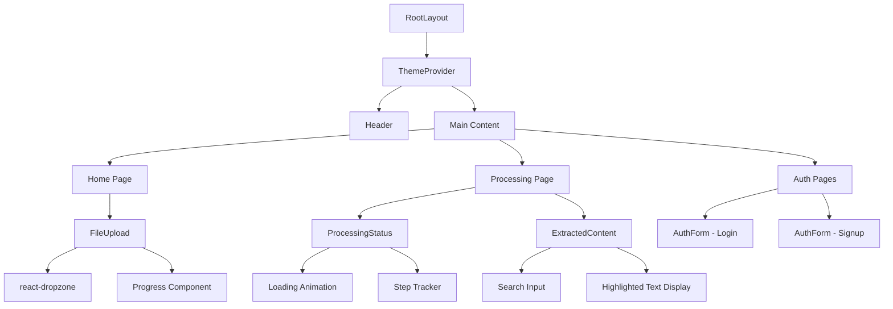
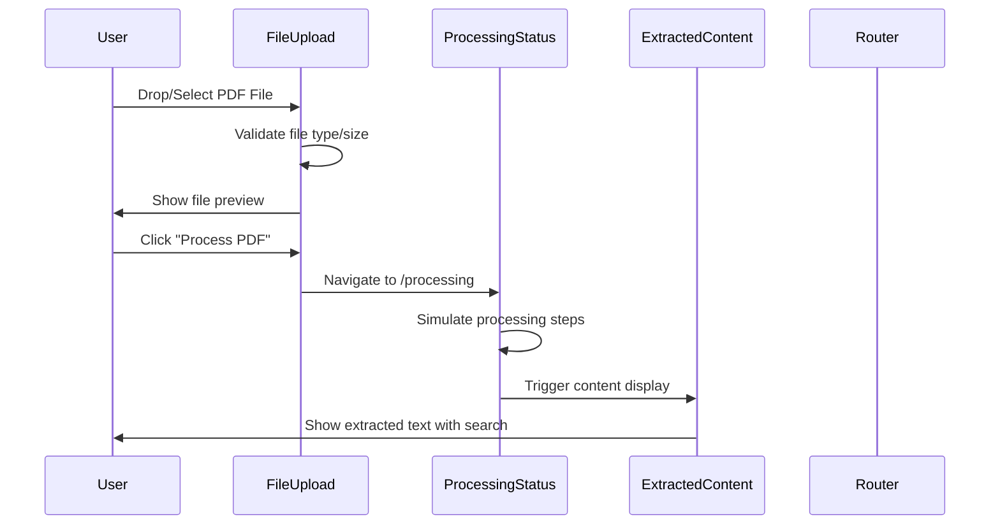
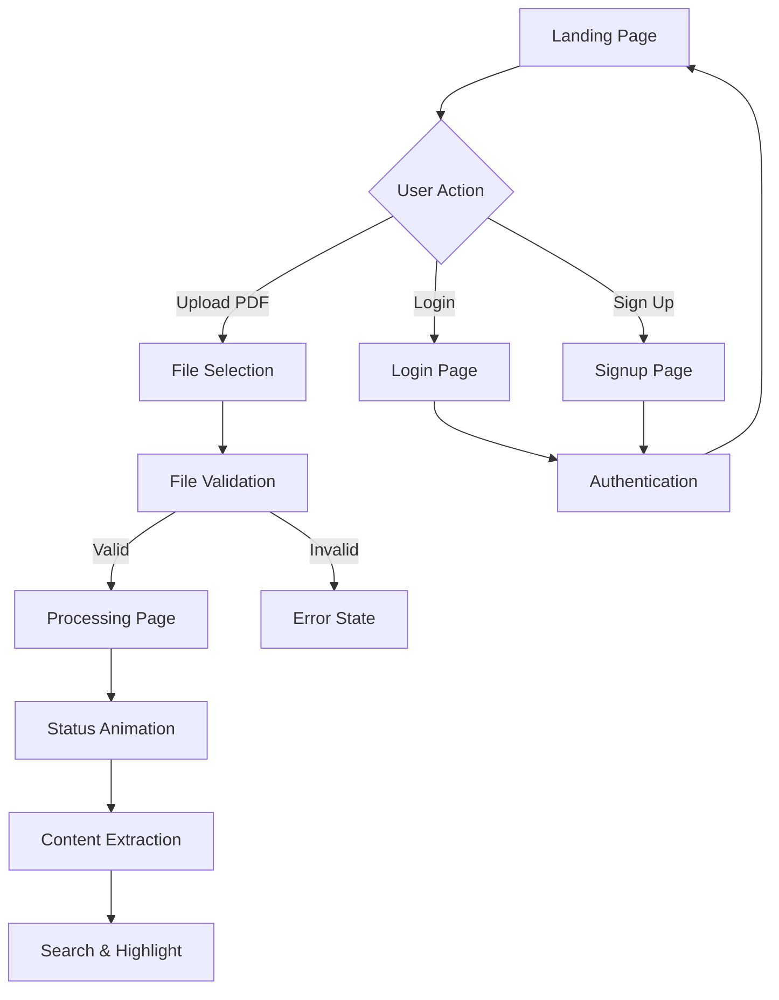

## **DocuMindIntelliOCR - Technical Documentation Plan**

### **1. Application Overview & Architecture**
- Next.js 15 App Router implementation
- TypeScript configuration and usage
- v0.dev integration and deployment pipeline
- Component-based architecture patterns

### **2. Component Hierarchy Diagram**

### **3. Data Flow Architecture**

### **4. User Journey Flow**

### **5. Technical Stack Deep Dive**
- **Frontend Framework**: Next.js 15 with App Router
- **Language**: TypeScript with strict type checking
- **Styling**: Tailwind CSS + CSS-in-JS patterns
- **UI Components**: Radix UI primitives with custom styling
- **State Management**: React useState/useEffect patterns
- **Form Handling**: react-hook-form + Zod validation
- **File Handling**: react-dropzone integration
- **Routing**: Next.js App Router with dynamic navigation

### **6. Component Architecture Analysis**
- **Layout Components**: [`RootLayout`](app/layout.tsx), [`Header`](components/header.tsx)
- **Core Features**: [`FileUpload`](components/file-upload.tsx), [`ProcessingStatus`](components/processing-status.tsx), [`ExtractedContent`](components/extracted-content.tsx)
- **Authentication**: [`AuthForm`](components/auth-form.tsx) with dual login/signup modes
- **UI System**: 40+ Radix UI components in [`components/ui/`](components/ui/)

### **7. Implementation Patterns**
- Client-side component patterns with "use client" directives
- Custom hooks usage ([`use-mobile.tsx`](hooks/use-mobile.tsx), [`use-toast.ts`](hooks/use-toast.ts))
- Conditional rendering based on application state
- File processing simulation with timeout-based progress tracking
- Search functionality with regex highlighting

### **8. Configuration & Build Setup**
- Next.js configuration ([`next.config.mjs`](next.config.mjs))
- TypeScript configuration ([`tsconfig.json`](tsconfig.json))
- Tailwind CSS setup ([`tailwind.config.ts`](tailwind.config.ts))
- Component registry ([`components.json`](components.json))

Would you like me to proceed with creating the full technical documentation markdown file with these detailed sections and Mermaid diagrams?